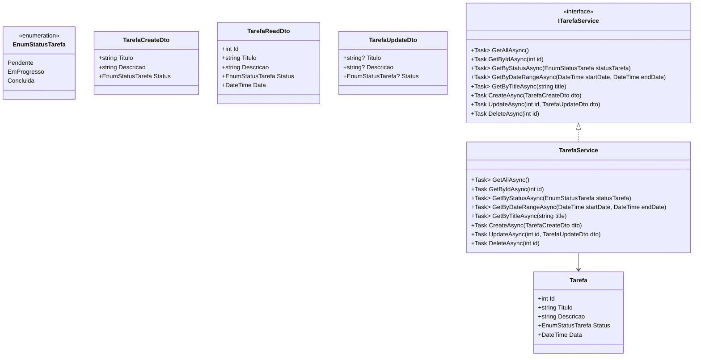

# 🗂️ Organizador de Tarefas

API desenvolvida em **.NET 9 (Minimal API)** para gerenciar tarefas, com suporte a CRUD completo, DTOs, filtragem por status, data e título.  
Projeto mantido por [Evandro Santos](https://github.com/vandersant7) e em constante evolução para se tornar uma aplicação completa com **frontend, CI/CD e banco de dados robusto**.

---

## 🚀 Tecnologias Atuais

- **.NET 9.0**
- **C# 12**
- **Entity Framework Core**
- **SQLite** (⚙️ futuro: migração para PostgreSQL)
- **Swagger / OpenAPI**
- **Injeção de dependência com Services**

---

## 📁 Estrutura Atual do Projeto

```plaintext
OrganizadorTarefa/
│
├── Data/
│   └── TarefaContext.cs
│
├── Endpoints/
│   └── TarefaEndpoints.cs
│
├── Models/
│   ├── Tarefa.cs
│   ├── EnumStatusTarefa.cs
│   └── DTOs/
│       ├── TarefaCreateDto.cs
│       ├── TarefaReadDto.cs
│       └── TarefaUpdateDto.cs
│
├── Services/
│   ├── ITarefaService.cs
│   └── TarefaService.cs
│
├── appsettings.json
├── Program.cs
└── README.md
````

---

## 🧩 Diagrama de Classes


---

## 📚 Endpoints

| Método     | Rota                                      | Descrição                     |
| ---------- | ----------------------------------------- | ----------------------------- |
| **GET**    | `/tarefas`                                | Retorna todas as tarefas      |
| **GET**    | `/tarefas/{id}`                           | Busca tarefa por ID           |
| **GET**    | `/tarefas/titulo/{title}`                 | Filtra por título             |
| **GET**    | `/tarefas/status/{status}`                | Filtra por status             |
| **GET**    | `/tarefas/data?startDate=...&endDate=...` | Filtra por intervalo de datas |
| **POST**   | `/tarefas`                                | Cria nova tarefa              |
| **PUT**    | `/tarefas/{id}`                           | Atualiza uma tarefa           |
| **DELETE** | `/tarefas/{id}`                           | Remove uma tarefa             |

---

## 🧠 Próximas Etapas Planejadas

| Etapa | Descrição                                                      | Status             |
| ----- | -------------------------------------------------------------- | ------------------ |
| 🧱 1  | Reestruturar pastas para padrão `src/`, `tests/` e `frontend/` | 🔄 Em planejamento |
| 🐘 2  | Migrar banco de dados de SQLite para PostgreSQL                | ⏳ Pendente         |
| 🧰 3  | Adicionar containerização com Docker e docker-compose          | ⏳ Pendente         |
| ⚙️ 4  | Criar pipeline de CI/CD com GitHub Actions                     | ⏳ Pendente         |
| 💻 5  | Implementar frontend (React ou Blazor)                         | ⏳ Pendente         |
| 🧪 6  | Adicionar testes unitários e de integração                     | ⏳ Pendente         |
| 🧾 7  | Publicar documentação final e melhorar README                  | ✅ Em andamento     |

---

## 🛠️ Executando o Projeto Localmente

### 1️⃣ Requisitos

* [.NET SDK 9.0](https://dotnet.microsoft.com/download)
* [SQLite](https://www.sqlite.org/)
* [Git](https://git-scm.com/)

### 2️⃣ Clone o repositório

```bash
git clone https://github.com/vandersant7/organizador-tarefas.git
cd organizador-tarefas
```

### 3️⃣ Execute as migrações

```bash
dotnet ef database update
```

### 4️⃣ Inicie o servidor

```bash
dotnet watch run
```

👉 Acesse o Swagger:
[http://localhost:5000/swagger](http://localhost:5000/swagger)

---

## 🧱 Futuro: Estrutura Planejada

```plaintext
organizador-tarefas/
│
├── src/
│   ├── OrganizadorTarefa.Api/
│   ├── OrganizadorTarefa.Frontend/
│
├── tests/
│   └── OrganizadorTarefa.Tests/
│
├── .github/workflows/
│   └── ci-cd.yml
│
├── docker-compose.yml
├── README.md
└── .gitignore
```

---

## ⚙️ Boas Práticas de Commits

Use sempre o padrão **Conventional Commits**:

| Tipo        | Quando usar                         |
| ----------- | ----------------------------------- |
| `feat:`     | Nova funcionalidade                 |
| `fix:`      | Correção de bug                     |
| `refactor:` | Refatoração sem mudar comportamento |
| `docs:`     | Alterações na documentação          |
| `test:`     | Adição/modificação de testes        |
| `chore:`    | Tarefas de manutenção               |

Exemplo:

```bash
git commit -m "feat(models): adicionar DTOs e entidade Tarefa"
```

---

## 🤝 Contribuindo

1. Faça um fork do repositório
2. Crie uma branch: `git checkout -b feature/nova-feature`
3. Commit suas alterações
4. Faça push da branch: `git push origin feature/nova-feature`
5. Abra um **Pull Request**

---

## 🧾 Licença

Este projeto está sob a licença **MIT**.
© 2025 - Desenvolvido por [Evandro Santos](https://github.com/vandersant7)

---

> 💬 Projeto em evolução — cada commit é um passo no aprendizado e profissionalização em desenvolvimento .NET e arquitetura de software.
